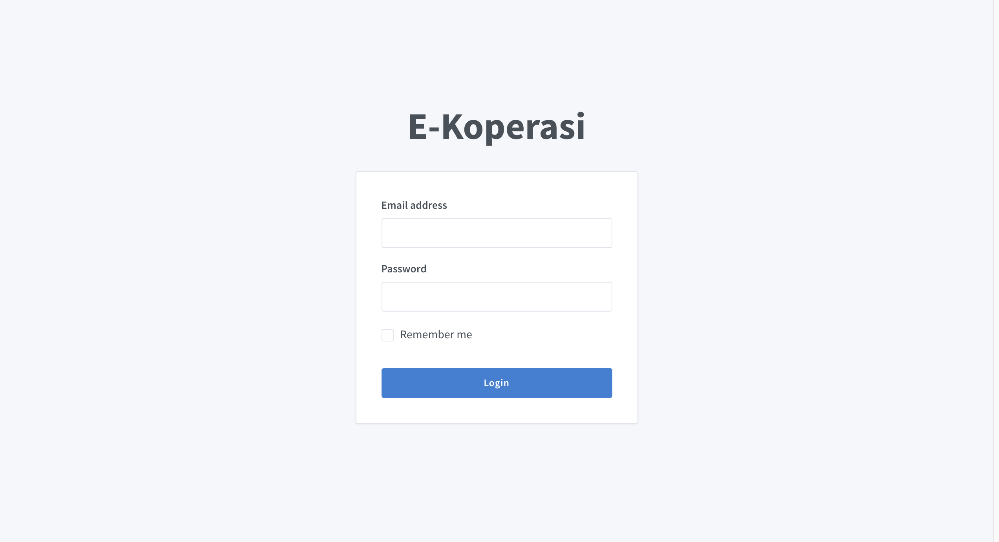
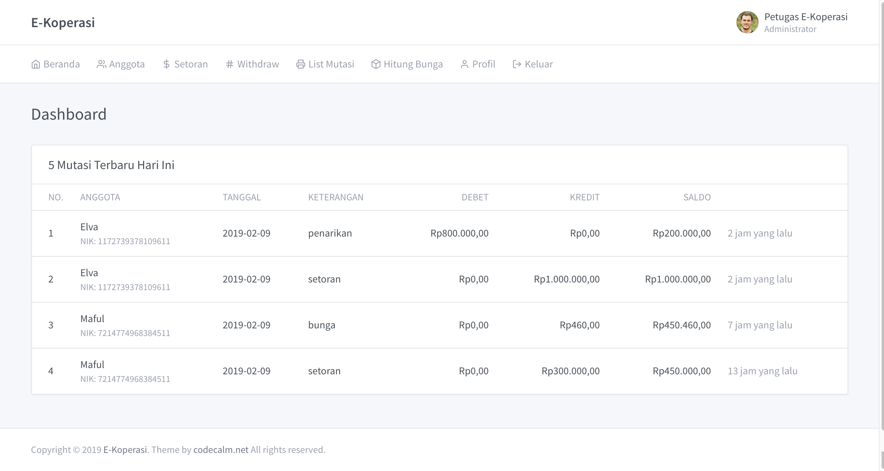

## E-COOPERATIVE

[](https://sonarcloud.io/dashboard?id=maful_e-koperasi)

Deposit and withdrawal management application with the type of Voluntary Savings with an interest of 6% per year.

## Installation

- Clone or download the project
- Install Dependencies with Composer `composer install`
- Copy environment `cp .env.example .env`
- Generate key `php artisan key:generate`
- Create database, for example `cooperative` and then change the DB_DATABASE value in .env
- Migrate database `php artisan migrate`
- Insert dummy data `php artisan db:seed`
- Run app `php artisan serve`

## Usage

Default credential

```
Email : ekoperasi@gmail.com
Password : secret
```

## Screenshots






More [screenshots](./screenshots)
